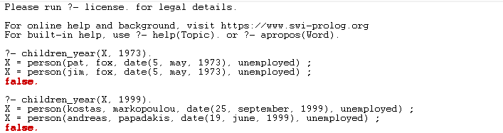
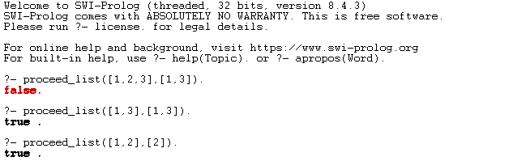
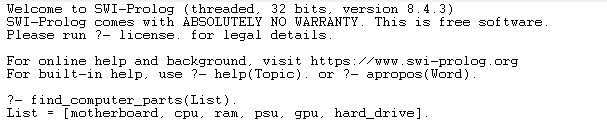
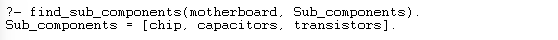
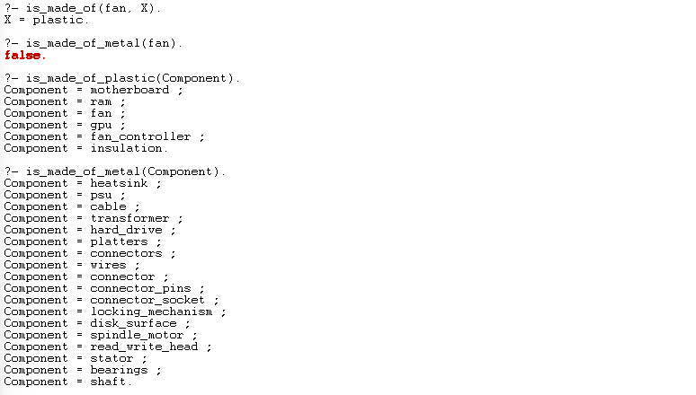

# Logic programming (2022) - Multiple Exercises

## Project Overview

This repository contains solutions for the exercises from the "Logical Programming" course, offered in the 5th semester of the 2022 academic year at the University of Piraeus, Department of Informatics. The exercises are implemented in Prolog, and each solution is accompanied by a detailed PDF document that includes the code and an example of correct execution.

## Course Information
- **Institution:** University of Piraeus
- **Department:** Department of Informatics
- **Course:** Logic programming (2022)
- **Semester:** 5th

## Technologies Used

- Prolog

## Repository Structure

The repository is organized into three folders, each corresponding to a specific exercise. Inside each folder, you will find:

- A `.pl` file containing the Prolog code for the exercise.
- A `.pdf` file with documentation, including an explanation of the solution and examples of correct execution.

## Exercise Descriptions

### Exercise 1
- **Task**: Implement Prolog predicates for managing and querying a database of families registered in a municipal registry.
- **Topics Covered**: Prolog knowledge base, list handling, querying with conditions based on family size, birth year, and employment status.



### Exercise 2
- **Task**: Write Prolog predicates to operate on lists, including determining list precedence, inclusion, and finding common elements.
- **Topics Covered**: List operations in Prolog, including sublist detection, element matching, and list pairing.



### Exercise 3
- **Task**: Model an object (e.g., a personal computer) in Prolog, including its components and subcomponents, and query its properties and materials.
- **Topics Covered**: Prolog facts and rules, hierarchical data modeling, material classification, and complex querying.





## How to Run the Code

1. Ensure you have Prolog installed on your machine.
2. Navigate to the desired exercise folder in your terminal or Prolog environment.
3. Load the Prolog file by running the following command:
   ```prolog
   [number-exercise].
   ```
   Replace `number` with the exercise number (first, second, or third).
4. Execute the queries provided in the documentation PDF to test the solutions.

## License

This project is licensed under the MIT License - see the [LICENSE](./LICENSE) file for details.
